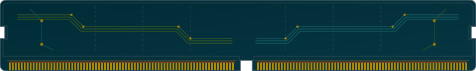
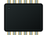
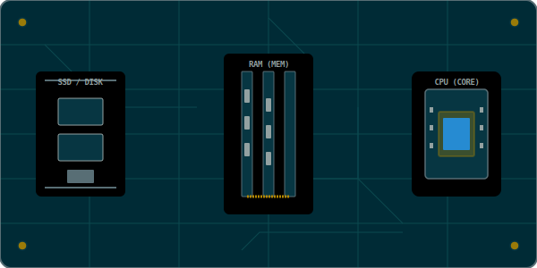

## Nature variable

```{ojs}
//| echo: false
// 📦 Imports centralisés pour tout le bloc
import { createWordCloud } from "./assets/js/networks.js"
import { createBar, createLine, createFunnel, createPiramid } from "./assets/js/plots.js"
import { getThemeColor } from "./assets/js/core.js"
```

::: {.grid}

::: {.g-col-12 .g-col-md-6}
::: {.card .card-concept .h-100}
::: {.card-header}
Nominale [Qualitative]{.badge .bg-info .float-end}
:::
::: {.card-body}

::: {#plot-nominale style="height: 180px;"}
```{ojs}
//| echo: false

motsNominal = ["Rouge", "France", "Standard", "69003", "Bleu", "Genre", "Directeur", "Italie", "Vert"]

renderNominale = {
  createWordCloud('plot-nominale', motsNominal, { radius: 80 }) //TODO: if not specified use current div instead of fixed id
}
```
:::

::: {.concept-details}
Catégories ou étiquettes sans aucun ordre de grandeur ni hiérarchie naturelle. Les chiffres ne servent que de codes d'identification.

::: {.callout-example}
**Exemples :** Couleur des yeux, Pays, Genre.
:::
:::
:::
:::
:::

::: {.g-col-12 .g-col-md-6}
::: {.card .card-concept .h-100}
::: {.card-header}
Ordinale [Qualitative]{.badge .bg-info .float-end}
:::
::: {.card-body}
::: {#plot-ordinale style="height: 180px;"}
```{ojs}
//| echo: false
renderOrdinale = {
  createPiramid("plot-ordinale", {
    text: ["Rang 3", "Rang 2", "Rang 1"],
    values: [20, 30, 50]
  }, {
    colors: [
      getThemeColor("--sol-yellow", "#b58900"),
      getThemeColor("--sol-cyan", "#2aa198"),
      getThemeColor("--sol-blue", "#268bd2")
    ]
  });
}
```
:::

::: {.concept-details}
Catégories textuelles dotées d'une hiérarchie stricte et d'une logique de rang. La distance mathématique entre rangs n'est pas mesurable.

::: {.callout-example}
**Exemples :** Niveau (S/M/L), Mention bac, Satisfaction.
:::
:::
:::
:::
:::

::: {.g-col-12 .g-col-md-6}
::: {.card .card-concept .h-100}
::: {.card-header}
Discrète [Quantitative]{.badge .bg-success .float-end}
:::
::: {.card-body}
::: {#plot-discrete style="height: 180px;"}
```{ojs}
//| echo: false
dataDiscrete = {
  let vals = Array.from({length: 5}, () => 10 + Math.floor(Math.random() * 80));
  return { x: ["0", "1", "2", "3", "4+"], y: vals };
}

renderDiscrete = {
  createBar("plot-discrete", dataDiscrete, "", {
    marker: { color: getThemeColor("--sol-green", "#859900") }, // Variable dynamique
    layout: { margin: { t: 10, b: 20, l: 30, r: 10 }, paper_bgcolor: 'transparent', plot_bgcolor: 'transparent' }
  });
}
```
:::

::: {.concept-details}
Valeurs numériques entières dénombrables. On compte des unités distinctes et complètes (pas de demi-mesure possible).

::: {.callout-example}
**Exemples :** Nombre d'enfants, clics web, transactions.
:::
:::
:::
:::
:::

::: {.g-col-12 .g-col-md-6}
::: {.card .card-concept .h-100}
::: {.card-header}
Continue [Quantitative]{.badge .bg-success .float-end}
:::
::: {.card-body}
::: {#plot-continuous style="height: 180px;"}
```{ojs}
//| echo: false
dataContinuous = {
  let x = [], y = [];
  for(let i = 15; i <= 135; i += 2) {
    x.push(i);
    let dx = (i - 75) / 20;
    y.push(85 * Math.exp(-0.5 * dx * dx));
  }
  return { x, y };
}

renderContinuous = {
  createLine("plot-continuous", dataContinuous, "", {
    mode: "lines",
    line: { shape: "spline", color: getThemeColor("--sol-blue", "#268bd2"), width: 3 },
    markerSize: 0,
    layout: { 
      margin: { t: 10, b: 20, l: 30, r: 10 },
      paper_bgcolor: 'transparent', 
      plot_bgcolor: 'transparent',
      hovermode: "x unified" 
    }
  });
}
```
:::
::: {.concept-details}
Valeurs décimales mesurables sur une échelle infinie. Il existe un nombre infini de possibilités réelles entre deux mesures.

::: {.callout-example}
**Exemples :** Température en °C, Salaire exact, Latitude.
:::
:::
:::
:::
:::

:::


## Cablage

::: {.card .card-window .mb-4}
```{ojs}
//| echo: false
import { parseTableData, renderFeedbackUI } from "./assets/js/core.js"
import { CablingManager } from "./assets/js/networks.js"
import { createLever } from "./assets/js/custom/lever.js"

```


::: {.card-header}
🔌 Panneau de brassage des indices
:::
::: {.card-body}

::: {#cabling-data style="display: none;"}

| id | label | match | feedback |
| --- | --- | --- | --- |
| postal | Code postal (ex: 75001) | nominale | Le code postal est nominal. Son traitement mathématique n'a aucun sens. |
| salaire | Salaire annuel en euros | continue | Le salaire s'exprime sur une échelle infinie de valeurs mesurables. |
| mention | Mention au bac (Bien, etc.) | ordinale | Catégories textuelles mais dotées d'une hiérarchie stricte. |
| fraud | Transactions frauduleuses | discrete | On dénombre des unités entières distinctes. |
:::

Reliez chaque pièce à conviction de gauche à sa catégorie de données logique de droite.

::: {.cabling-panel}

::: {.panel-screw .top-left}
:::
::: {.panel-screw .top-right}
:::
::: {.panel-screw .bottom-left}
:::
::: {.panel-screw .bottom-right}
:::

::: {.cabling-workspace-wrapper}

::: {#cabling-canvas}
:::

::: {#power-lever .lever-wrapper}

::: {.lever-housing}

[ON]{.lever-label-top}

::: {.lever-slot}
:::

::: {.lever-handle}
:::

::: {.lever-led}
:::

[OFF]{.lever-label-bottom}

:::

[Circuit alimenté]{#lever-status-on .lever-status .is-on style="display: none;"}
[Circuit coupé]{#lever-status-off .lever-status .is-off}

```{ojs}
//| echo: false
{
  powerOn;
  const elOn = document.querySelector("#lever-status-on");
  const elOff = document.querySelector("#lever-status-off");
  if (elOn && elOff) {
    elOn.style.display = powerOn ? "inline-block" : "none";
    elOff.style.display = powerOn ? "none" : "inline-block";
  }
  return html`<span style="display: none;"></span>`;
}
```

:::

:::

:::


```{ojs}
//| echo: false
viewof powerOn = createLever("#power-lever", invalidation)
```


::: {#cabling-feedback-panel .terminal .mt-4 style="display: none;"}

::: {.card-header}
:::

::: {.card-body}

::: {.feedback-card .feedback-incomplete .terminal-line .text-warning .fw-bold .mb-3}
[!] SIGNAL BROUILLÉ : Brassage incomplet. L'analyse ne peut pas démarrer ({{score}}/{{total}} connectés).
:::

::: {.feedback-card .feedback-validated .terminal-line .text-success .fw-bold .mb-3}
[+] DIAGNOSTIC VALIDÉ : Excellent travail, le signal est pur ({{score}}/{{total}} corrects).
:::

::: {.feedback-card .feedback-error .terminal-line .text-danger .fw-bold .mb-3}
[-] CONFLIT DE SIGNAL : Des courts-circuits subsistent. Analysez la nature des variables ({{score}}/{{total}} corrects).
:::

::: {.feedback-details .reveal-lines}
:::

:::

:::

```{ojs}
//| echo: false

// A. Chargement et déduction des listes
leftItems = parseTableData("#cabling-data table")
rightItems = Array.from(new Set(leftItems.map(item => item.match))).map(id => ({
  id: id,
  label: id.charAt(0).toUpperCase() + id.slice(1) 
}))

// B. Cycle de vie du moteur graphique
engine = {
  const m = new CablingManager("#cabling-canvas", leftItems, rightItems, (state) => {
    if(state.score < leftItems.length) renderFeedbackUI("#cabling-feedback-panel", { status: "hidden" });
  });
  invalidation.then(() => m.destroy());
  return m;
}

// C. Pipeline réactif d'affichage du Feedback (déclenché par le levier)
uiLogic = {
  powerOn; // Réactivité sur le levier

  let state = { status: "hidden" };

  if (powerOn === true) {
    // Levier ON  → valider le brassage
    state = engine.validate();
  } else {
    // Levier OFF → masquer les résultats, enlever les étincelles et la validation (garder les câbles)
    engine.clearValidation();
    renderFeedbackUI("#cabling-feedback-panel", { status: "hidden" });
    return;
  }

  let listData = [];
  if (state.status === "validated") {
    const isPerfect = state.score === leftItems.length;
    state.status = isPerfect ? "validated" : "error"; 
    
    listData = leftItems.map(item => {
      const isCorrect = state.connections[item.id] === item.match;
      const rMatch = rightItems.find(r => r.id === state.connections[item.id]);
      return {
        label: item.label,
        rightLabel: rMatch ? rMatch.label : "?",
        badgeClass: isCorrect ? "text-success" : "text-danger",
        badgeText: isCorrect ? "OK" : "Erreur",
        feedback: isCorrect ? item.feedback : "Incohérence détectée dans le choix de l'échelle."
      };
    });
  }

  // Distribution vers l'interface via core.js
  renderFeedbackUI("#cabling-feedback-panel", state, listData);
}

```


## Encodage en Mémoire (RAM)

::: {.card .card-window .mb-4}
::: {.card-header}
💾 Simulateur d'Encodage Physique
:::

::: {.card-control-row}
[42]{#rawInput .search-bar .bi-keyboard placeholder="Entrez une valeur…"}
:::

```{ojs}
//| echo: false
import { renderTemplate, renderListTemplate } from "./assets/js/core.js"
import { createTabsetWatcher } from "./assets/js/custom/card.js"

// Reactive value — driven by the tab watcher below
mutable dataType = "int32"

// Icon injection + MutationObserver + value sync — all handled by core.js
_ramTabWatcher = {
  const w = createTabsetWatcher(
    ".ram-tabset",
    { "bool": "bool", "int8": "int8", "int32": "int32", "float64": "float64", "string": "string" },
    (val) => { mutable dataType = val; }
  );
  invalidation.then(() => w.destroy());
  return html`<span style="display:none"></span>`;
}
```

::: {.panel-tabset .ram-tabset}

## bool {.bi-toggles}

::: {.card .border-0 .shadow-none .bg-transparent .mb-0}
::: {.card-body .p-0 .pb-2}
| Caractéristique | Spécification |
| :--- | :--- |
| **Type de donnée** | Booléen (Logique) |
| **Taille Physique** | 1 octet (8 bits) |
| **Encodage RAM** | `00000001` (True / Vrai) \| `00000000` (False / Faux) |
| **Comportement** | Bien que 1 bit suffise théoriquement, la mémoire est adressée par octets complets physiques. |
:::
:::

## int8 {.bi-1-circle}

::: {.card .border-0 .shadow-none .bg-transparent .mb-0}
::: {.card-body .p-0 .pb-2}
| Caractéristique | Spécification |
| :--- | :--- |
| **Type de donnée** | Entier 8 bits (Byte / Octet) |
| **Taille Physique** | 1 octet (8 bits) |
| **Plage de valeurs** | de `0` à `255` (non signé) \| de `-128` à `127` (signé) |
| **Comportement** | Encodage binaire direct. Les valeurs négatives sont stockées en complément à deux. |
:::
:::

## int32 {.bi-hash}

::: {.card .border-0 .shadow-none .bg-transparent .mb-0}
::: {.card-body .p-0 .pb-2}
| Caractéristique | Spécification |
| :--- | :--- |
| **Type de donnée** | Entier 32 bits (Mot Standard) |
| **Taille Physique** | 4 octets (32 bits) |
| **Plage de valeurs** | de `-2 147 483 648` à `+2 147 483 647` |
| **Comportement** | Découpé en 4 octets consécutifs en mémoire, respectant l'endianness (boutisme) de l'architecture. |
:::
:::

## float64 {.bi-infinity}

::: {.card .border-0 .shadow-none .bg-transparent .mb-0}
::: {.card-body .p-0 .pb-2}
| Caractéristique | Spécification |
| :--- | :--- |
| **Type de donnée** | Réel double précision (Double / Float64) |
| **Taille Physique** | 8 octets (64 bits) |
| **Standard** | Norme internationale IEEE 754 |
| **Structure** | 1 bit de signe, 11 bits d'exposant, 52 bits de mantisse |
| **Comportement** | Représentation scientifique précise, découpée sur 8 octets consécutifs. |
:::
:::

## string {.bi-fonts}

::: {.card .border-0 .shadow-none .bg-transparent .mb-0}
::: {.card-body .p-0 .pb-2}
| Caractéristique | Spécification |
| :--- | :--- |
| **Type de donnée** | Chaîne de caractères (String) |
| **Taille Physique** | Variable (1 octet par caractère en ASCII / UTF-8 standard) |
| **Encodage RAM** | Code numérique de chaque caractère (Table ASCII / Points de code Unicode) |
| **Comportement** | Séquence contiguë d'octets. Les caractères spéciaux hors ASCII peuvent prendre plusieurs octets. |
:::
:::

:::

::: {.card-body}

```{ojs}
//| echo: false
viewof rawInput = {
  const el = document.querySelector("#rawInput");
  return el;
}
```

::: {.ram-motherboard}

::: {.ram-stick #ram-stick-1}
{.background}

::: {.ram-bytes-container #ram-bytes-container-1}
:::
:::

::: {.ram-stick #ram-stick-2}
{.background}

::: {.ram-bytes-container #ram-bytes-container-2}
:::
:::

:::

::: {.ram-byte-template .d-none}
::: {.d-flex .flex-column .align-items-center .m-1}
::: {.ram-byte-box class="{{inactiveClass}}" title="Bits: {{binary}}"}
{.background}
{{hex}}
:::
[Octet {{index}}]{.badge .bg-secondary .mb-1 .font-code}
:::
:::

:::

```{ojs}
//| echo: false
import { getRamData, renderRam } from "./assets/js/custom/ram.js";

// 1. Logique de conversion réactive
ramData = getRamData(rawInput, dataType)

// 2. Déclenchement réactif de l'affichage (Effet de bord OJS)
updateRamUI = renderRam(ramData)
```

## Architecture Matérielle & Flux de Données

::: {.card .card-window .mb-4}
::: {.card-header}
🖥️ Simulateur de flux d'exécution & Hiérarchie Mémoire
:::
::: {.panel-tabset .mobo-tabset}

## SSD {.bi-hdd-network}

::: {.card .border-0 .shadow-none .bg-transparent .mb-0}
::: {.card-body .p-0 .pb-2}
::: {.grid .align-items-center}
::: {.g-col-12 .g-col-md-7}
**Stockage permanent (SSD) :** Au repos, toutes les données de votre projet (les fichiers CSV, les scripts Python) dorment sur le Disque Dur. C'est le niveau d'accès le plus lent, mais avec une capacité de stockage immense et non volatile (les données restent à l'extinction).
:::
::: {.g-col-12 .g-col-md-5}
::: {.card .bg-light .border .p-3 .rounded .shadow-sm .mb-0}
::: {.font-code .fw-bold .mb-3 style="font-size: 0.8rem;"}
📊 Profil de performance : SSD
:::
::: {.mb-3}
::: {.d-flex .justify-content-between .font-code .mb-1 style="font-size: 0.72rem;"}
[🟩 Vitesse d'accès]{}
[15 000 ns (Très lent)]{.text-muted}
:::
::: {.progress style="height: 6px;"}
::: {.progress-bar .bg-danger style="width: 1%;" title="Vitesse"}
:::
:::
:::
::: {}
::: {.d-flex .justify-content-between .font-code .mb-1 style="font-size: 0.72rem;"}
[🟦 Capacité de stockage]{}
[1 TB (Immense)]{.text-muted}
:::
::: {.progress style="height: 6px;"}
::: {.progress-bar style="width: 100%; background-color: #268bd2;" title="Capacité"}
:::
:::
:::
:::
:::
:::
:::
:::

## RAM {.bi-memory}

::: {.card .border-0 .shadow-none .bg-transparent .mb-0}
::: {.card-body .p-0 .pb-2}
::: {.grid .align-items-center}
::: {.g-col-12 .g-col-md-7}
**Mémoire vive (RAM) :** Lorsque vous exécutez `pd.read_csv("data.csv")`, les données transitent du SSD vers la RAM sous le contrôle du Chipset. La RAM est beaucoup plus rapide que le SSD, mais elle est volatile (vidée à l'extinction) et sa capacité reste limitée.
:::
::: {.g-col-12 .g-col-md-5}
::: {.card .bg-light .border .p-3 .rounded .shadow-sm .mb-0}
::: {.font-code .fw-bold .mb-3 style="font-size: 0.8rem;"}
📊 Profil de performance : RAM
:::
::: {.mb-3}
::: {.d-flex .justify-content-between .font-code .mb-1 style="font-size: 0.72rem;"}
[🟩 Vitesse d'accès]{}
[60 ns (Rapide)]{.text-muted}
:::
::: {.progress style="height: 6px;"}
::: {.progress-bar .bg-warning style="width: 35%;" title="Vitesse"}
:::
:::
:::
::: {}
::: {.d-flex .justify-content-between .font-code .mb-1 style="font-size: 0.72rem;"}
[🟦 Capacité de stockage]{}
[16 GB (Grande)]{.text-muted}
:::
::: {.progress style="height: 6px;"}
::: {.progress-bar style="width: 65%; background-color: #268bd2;" title="Capacité"}
:::
:::
:::
:::
:::
:::
:::
:::

## Cache L3 {.bi-layers-half}

::: {.card .border-0 .shadow-none .bg-transparent .mb-0}
::: {.card-body .p-0 .pb-2}
::: {.grid .align-items-center}
::: {.g-col-12 .g-col-md-7}
**Cache de niveau 3 (L3) :** Pour devancer les besoins du processeur, les données sont pré-chargées depuis la RAM vers le Cache L3 de la puce. Ce cache est partagé entre tous les cœurs du CPU. Sa vitesse est très élevée, mais sa taille se compte en mégaoctets.
:::
::: {.g-col-12 .g-col-md-5}
::: {.card .bg-light .border .p-3 .rounded .shadow-sm .mb-0}
::: {.font-code .fw-bold .mb-3 style="font-size: 0.8rem;"}
📊 Profil de performance : Cache L3
:::
::: {.mb-3}
::: {.d-flex .justify-content-between .font-code .mb-1 style="font-size: 0.72rem;"}
[🟩 Vitesse d'accès]{}
[10 ns (Très rapide)]{.text-muted}
:::
::: {.progress style="height: 6px;"}
::: {.progress-bar .bg-success style="width: 70%;" title="Vitesse"}
:::
:::
:::
::: {}
::: {.d-flex .justify-content-between .font-code .mb-1 style="font-size: 0.72rem;"}
[🟦 Capacité de stockage]{}
[16 MB (Très petite)]{.text-muted}
:::
::: {.progress style="height: 6px;"}
::: {.progress-bar style="width: 8%; background-color: #268bd2;" title="Capacité"}
:::
:::
:::
:::
:::
:::
:::
:::

## Caches L2 & L1 {.bi-lightning-charge}

::: {.card .border-0 .shadow-none .bg-transparent .mb-0}
::: {.card-body .p-0 .pb-2}
::: {.grid .align-items-center}
::: {.g-col-12 .g-col-md-7}
**Caches cœurs L2 & L1 :** Pour accélérer encore le traitement, chaque cœur possède ses propres caches dédiés L2 (moyen) et L1 (ultra-rapide). La donnée demandée est descendue au plus près des unités de calcul (Hit) pour éviter l'accès RAM extrêmement pénalisant (Miss).
:::
::: {.g-col-12 .g-col-md-5}
::: {.card .bg-light .border .p-3 .rounded .shadow-sm .mb-0}
::: {.font-code .fw-bold .mb-3 style="font-size: 0.8rem;"}
📊 Profil de performance : Caches L1/L2
:::
::: {.mb-3}
::: {.d-flex .justify-content-between .font-code .mb-1 style="font-size: 0.72rem;"}
[🟩 Vitesse d'accès]{}
[1 - 3 ns (Ultra-rapide)]{.text-muted}
:::
::: {.progress style="height: 6px;"}
::: {.progress-bar .bg-success style="width: 90%;" title="Vitesse"}
:::
:::
:::
::: {}
::: {.d-flex .justify-content-between .font-code .mb-1 style="font-size: 0.72rem;"}
[🟦 Capacité de stockage]{}
[576 KB (Extrêmement petite)]{.text-muted}
:::
::: {.progress style="height: 6px;"}
::: {.progress-bar style="width: 3%; background-color: #268bd2;" title="Capacité"}
:::
:::
:::
:::
:::
:::
:::
:::

## Registres {.bi-cpu}

::: {.card .border-0 .shadow-none .bg-transparent .mb-0}
::: {.card-body .p-0 .pb-2}
::: {.grid .align-items-center}
::: {.g-col-12 .g-col-md-7}
**Registres & CPU :** Tout en haut de la pyramide, les registres internes du cœur traitent les données à la vitesse du processeur (calculs arithmétiques immédiats en moins d'une fraction de nanoseconde). C'est la mémoire ultime en vitesse, mais limitée à quelques octets !
:::
::: {.g-col-12 .g-col-md-5}
::: {.card .bg-light .border .p-3 .rounded .shadow-sm .mb-0}
::: {.font-code .fw-bold .mb-3 style="font-size: 0.8rem;"}
📊 Profil de performance : Registres
:::
::: {.mb-3}
::: {.d-flex .justify-content-between .font-code .mb-1 style="font-size: 0.72rem;"}
[🟩 Vitesse d'accès]{}
[< 0.3 ns (Instantané)]{.text-muted}
:::
::: {.progress style="height: 6px;"}
::: {.progress-bar .bg-success style="width: 100%;" title="Vitesse"}
:::
:::
:::
::: {}
::: {.d-flex .justify-content-between .font-code .mb-1 style="font-size: 0.72rem;"}
[🟦 Capacité de stockage]{}
[512 B (Infime)]{.text-muted}
:::
::: {.progress style="height: 6px;"}
::: {.progress-bar style="width: 0.5%; background-color: #268bd2;" title="Capacité"}
:::
:::
:::
:::
:::
:::
:::
:::

:::

::: {.card-body}
::: {.d-flex .justify-content-center .align-items-center .mt-2}
::: {.motherboard-view #motherboard-view .w-100}
{.background}
:::
:::
:::

:::

```{ojs}
//| echo: false
import { initMoboSvg, renderMobo } from "./assets/js/custom/mobo.js";

// 1. Initialisation dynamique de la carte mère vectorielle (Inline SVG)
initMobo = initMoboSvg("#motherboard-view")

// 2. Détecteur réactif du Tabset de la carte mère (géré via card.js)
mutable hardwareState = "ssd"

_moboTabWatcher = {
  const w = createTabsetWatcher(
    ".mobo-tabset",
    { "SSD": "ssd", "RAM": "ram", "Cache L3": "l3", "Caches L2 & L1": "l2_l1", "Registres": "cpu_reg" },
    (val) => { mutable hardwareState = val; }
  );
  invalidation.then(() => w.destroy());
  return html`<span style="display:none"></span>`;
}

// 3. Déclenchement réactif des animations de flux physiques et highlights
updateMotherboardUI = {
  initMobo; // Attente inlining SVG
  renderMobo(hardwareState);
}
```